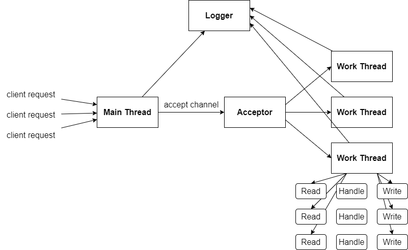

# A Fast Web Server based on C++ language 
## Overview
This project is a web server using C++14, using IO multiplexing technology to improve IO efficiency, and using a small root heap-based timer to close timeout requests to avoid excessive resource usage, and implement nanosecond-level logs based on Nanolog The system further improves performance.

## The superiority and technology
1. Use the two buffer to cache the message stream for preventing the overflow and data loss in the asynchronous logging sytem.
2. Compress the integer format data or message to reduce the data size to build a nanolog system (Under develop).
3. Use new feature in C++ 14 such as smart pointer and so on to reduce the risk of memory leak.
4. Use the epoll to edge-triggered with realizing non-blocking I/O.
5. Realize a thread task queue for the thread pool, triggered by a condition variable (with a mutex lock) to notify the new task. In the meantime, add the timer with each task and use the priority queue to manage these timers, which includes a minimum heap to remove those timeout requests timely.
6. Divide the threads into two types. The main thread waits the events from the epoll and add these events into the task queue, remove the timeout request events and needed-deleted timer in the end of iterator. The work thread is blocking and wait by the condition variable, then it will be wake up when a new task is arrived, and process the I/O read and write operators and some processing. Besides, it will be added into epoll to continue listen and monitor if it needed.

## Architecture
### Concurrency structure
The server use the Reactor model and use the multi-thread to improve the performance of concurrency. The epoll is used to realize the I/O multiplexing by monitor multiple file descriptors. Besides, it will create a thread poll to create a fixed number threads for multi-thread. The concurrency structure is displayed as followed:

There is only a main thread (MainThread), which is responded to the client's connection request event and establish an HTTP connection with the client. After connecting a client, it will assign this connection to a work thread (SubThread) to maintenance and handing this connection with the client by the Round Robin algorithm. The assignment needed a mutex lock to protect from the data race occur in the multi-thread interaction, which is created by a special loop thread. 

The work thread is running independently, and maintain an independent NIO Selector. If this work thread is blocking by epoll_wait() when the main thread assigns a new connection task to it, the eventfd will be used to wake up this work thread asynchronously by getting an active event to handle. Design RunInLoop and QueueInLoop to call and process the CallBack function asynchronously and cross-thread inspired by the muduo multi-thread server model. 

In this project, each thread will have an event loop to handle event queue following the principle of "One loop one thread".

### Timer
Each work thread has a timer to handle those timeout requests and non-alive HTTP connections for long time. In this project, the priority queue is used to store the timers and utilizes the deleted flag to mark those timers that will be deleted. 

The node to be deleted will be delay to delete when the node is timeout or all higher priority nodes than it were deleted in order to save the time and improve performance. Delaying delete operator in max TIMEOUT time also will provide a cache time to keep a null request thread for escaping the re-new and re-delete of a new thread node when a new request reaches the server. 

### I/O multiplexing
The Epoll is used to realize I/O multiplexing. The epoll monitors multiple file descriptors to see if I/O is possible on any of them. The Epoll can be used either as an edge-triggered or a level-triggered interface and scales well to large numbers of watched file descriptors.

When it works under edge-triggered model, it delivers events when changes occur on the monitored file descriptor. Therefore, the suggested way to use epoll as an edge-triggered mode is as follows: 1. with non-blocking file descriptors; 2. by waiting for an event only after read or write return EAGAIN. As for level-triggered interface (default mode), epoll is simply a faster poll, which can be used wherever the latter is used since it shares the same semantics. 

This project chooses the edge-triggered interface, which have a higher requirement than level-triggered mode for read or write. Read or write operators have to handle data from pipe completely and return a EAGAIN. The level-triggered is simple because it is equivalent to a faster poll to read a litter once.

### Log
At the beginning, this project want to realize a nanolog system to realize the logging in the nanosecond. This system has a higher performance by compressing the integer string to save the length of the message. However, there are many problems happened in the way of realizing it. Refer to the muduo project, the project realizes a simple log system by separating the I/O thread and Log thread. I/O is slow and will slow down the concurrent performance of the entire system. Therefore, separating the I/O operator and logging operator and set multiple buffer between them will adjust the performance between them to get high overall performance. The buffer list includes multiple buffers, which write the data into the log file when the iterator number meets the pre-set requirements or the buffer is full. These buffers are divided into two groups, which includes two main buffers to cache the data in each group. When a main buffer is full, another main buffer will succeed to get the data. When these two main buffer are full or the iterator is timeout, another group will succeed to cache the data and this group will transfer to background to write cached data into log files. Of course, if another group is writing data into log file and cannot succeed to cache the data, the new buffer of current group will be created to continue get the data until another group is ready to succeed it. The nanolog system will come soon in next version.              

## References
[1]. [Epoll(7) - Linux man page.](https://linux.die.net/man/7/epoll)

[2]. [Muduo: Event-driven network library for multi-threaded Linux server in C++11](https://github.com/chenshuo/muduo)

[3]. [WebServer: A C++ High Performance Web Server](https://github.com/linyacool/WebServer)

